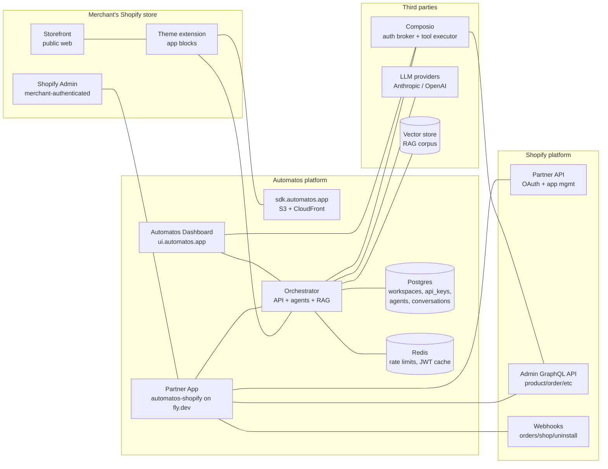
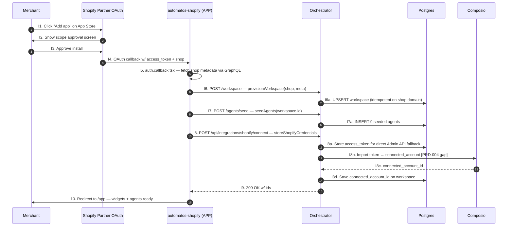
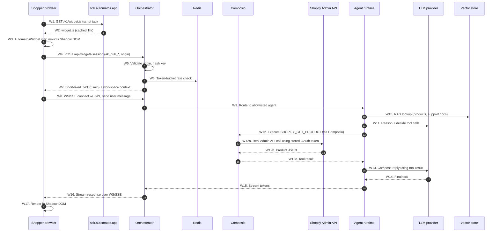
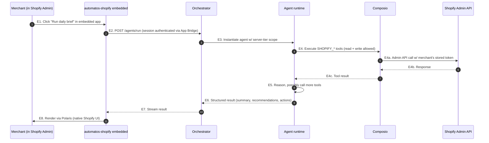
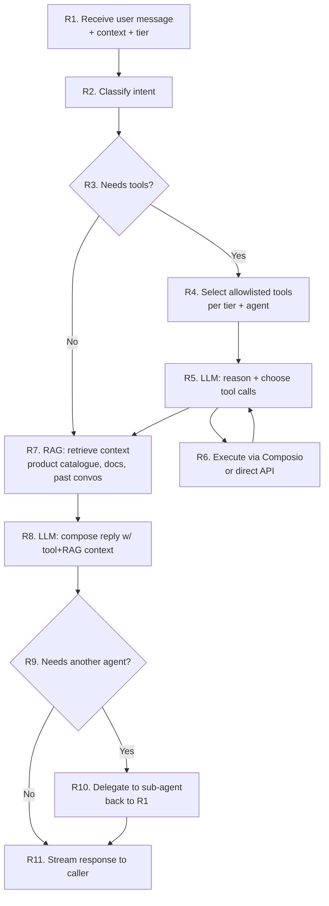

# Automatos ↔ Shopify — Architecture & Flows

**Purpose:** single reference for how the pieces connect and what happens in each scenario. Every step is labelled so PRDs, tickets, and debugging conversations can cite `W3` or `I7` instead of re-describing the flow.

**Last updated:** 2026-04-17

---

## 1. System map (static view)

Everything that exists, and the links between them. No direction of flow — just "A knows about B".

### Component glossary

| Label | Name | What it owns | PRD |
|---|---|---|---|
| `SF` | Storefront | Shopper-facing public web pages | — |
| `ADM` | Shopify Admin | Merchant's admin console; host of the embedded app | — |
| `TH` | Theme extension | `extensions/automatos-theme/blocks/*.liquid` — app blocks the merchant drops into their theme | 003, 005 |
| `SP` | Partner API | Shopify's OAuth + app management API | — |
| `SA` | Admin GraphQL API | The real Shopify data plane (products, orders, customers) | — |
| `SW` | Webhooks | Shopify → Automatos push (orders/create, shop/update, app/uninstalled, compliance) | 001 |
| `APP` | Partner App | `automatos-shopify` React-Router embedded app on fly.dev | 001, 004 |
| `CDN` | Widget CDN | `sdk.automatos.app` — S3 + CloudFront, serves `widget.js` | 003 |
| `ORCH` | Orchestrator | Automatos backend — API endpoints, agent runtime, tool routing | 004, 006 |
| `DB` | Postgres | Workspaces, api_keys, agents, conversations, audit log | 006 |
| `REDIS` | Redis | Rate-limit token buckets, JWT revocation, session cache | 006 |
| `DASH` | Dashboard | `ui.automatos.app` — standalone Automatos frontend | — |
| `COMP` | Composio | External SaaS — holds per-merchant Shopify OAuth tokens, executes ~394 Shopify tools | 004 |
| `LLM` | LLM providers | Anthropic / OpenAI — agent reasoning | — |
| `VEC` | Vector store | RAG corpus (product catalogue, docs, past conversations) | — |

---

## 2. Flow I — App Store install (merchant onboards)

**Trigger:** merchant clicks "Add app" on the Shopify App Store listing.
**Goal:** after this flow, the merchant has a workspace, 9 seeded agents, a stored Shopify access token, and a Composio connected_account — all without leaving Shopify admin.

**Current status:** steps `I1–I7` are live. Step `I8` is the gap PRD-004 closes.

**Labels for conversation:**
- `I4` — where Shopify hands us the merchant's access token
- `I6` — workspace provisioning (open question: auto-provision vs link-existing — blocks PRD-004)
- `I8b` — the ONE missing piece for single-flow install (tonight's spike found `.create()` doesn't exist; tomorrow probes `.link()` / `.update()`)

---

## 3. Flow W — Storefront widget conversation (shopper asks something)

**Trigger:** shopper on the merchant's storefront interacts with an Automatos widget (chat, product-qa, blog, etc.).
**Goal:** widget shows a response that may involve real-time Shopify data (stock, price, order status) routed via Composio.

**Labels for conversation:**
- `W1–W2` — the CDN hop (PRD-003). Failure here = widget never loads.
- `W4–W7` — the auth handshake (PRD-006). `ak_pub_*` never crosses the wire after `W4`; JWT does.
- `W9` — agent allowlist enforcement (public key can only invoke scoped agents).
- `W12` — Composio hop. If PRD-004 hasn't wired the connected_account, this 403s.
- `W12a` — this is why the merchant must complete the Composio connect step (or why PRD-004 matters).

**Two-way traffic note:** `W8`, `W15`, `W16` are the persistent WS/SSE channel. Everything after the initial handshake is streamed — widget and orchestrator stay connected for the conversation duration.

---

## 4. Flow E — Embedded admin agent action (merchant asks for something)

**Trigger:** merchant inside Automatos embedded app in Shopify Admin clicks "Daily brief", "Run audit", etc.
**Goal:** agent executes write-scope Shopify operations using the server-side token, not the widget public key.

**Labels for conversation:**
- `E2` — authentication uses the Shopify App Bridge session token, not `ak_pub_*`. Different tier → can invoke write-scope tools.
- `E4` — same Composio hop as `W12`, but the agent runtime is operating under the server-key scope, so `write_products`, `draft_orders/create` etc are permitted.
- `E8` — admin widgets use native Polaris (per PRD-005 Option A). No Shadow DOM like storefront.

---

## 5. Flow R — Agent reasoning (internal)

**Trigger:** called from `W9` or `E3`. Not visible outside the orchestrator.
**Goal:** turn a user message into a response, using any combination of tools, RAG, and sub-agents.

**Labels for conversation:**
- `R4` — where PRD-006's tool allowlist kicks in. Public-key agents get read-only; server-key agents get read+write.
- `R7` — RAG corpus per-workspace. Product catalogue synced from Shopify, support docs uploaded in dashboard.
- `R10` — agent-to-agent delegation. E.g. `shopify-support` asks `shopify-product-expert` for stock detail.

---

## 6. Boundaries & trust summary

Quick mental model of what crosses which trust boundary — useful for security reviews.

| Boundary | What crosses | Who controls it | Auth mechanism |
|---|---|---|---|
| Shopper browser → CDN | Public JS | Automatos | None (public asset) |
| Shopper browser → Orchestrator | User message + JWT | Shopper (can see JWT) | Short-lived origin-bound JWT |
| Widget JS → Orchestrator (init only) | `ak_pub_*` | Merchant (baked in Liquid) | Origin allowlist + rate limit (PRD-006) |
| Orchestrator → Composio | Agent requests | Automatos | Composio API key (server-only) |
| Composio → Shopify Admin API | Tool executions | Composio | Per-merchant stored OAuth token |
| Merchant Admin → Embedded app | App Bridge session | Merchant | Shopify session token (short-lived, signed) |
| Webhook source → Orchestrator | Shopify → Automatos pushes | Shopify | HMAC signature verify |

**The public API key (`ak_pub_*`) is the only credential that appears client-side.** Everything else — Shopify access token, Composio API key, LLM keys, RAG credentials — lives server-side only. This is the whole reason PRD-006 exists.

---

## 7. "Two-way" clarifications

User asked: *is the storefront widget → orchestrator flow two-way?*

**Yes, twice:**

1. **Session init (request/response):** `W4` → `W7` is a simple POST/response over HTTPS. One-shot.
2. **Conversation stream (persistent):** `W8` opens a WebSocket or SSE channel that stays alive for the duration of the chat. `W15`/`W16` stream tokens back as the LLM produces them. The shopper can send follow-up messages over the same channel without re-initiating.

**Storefront widget → Shopify:** indirect — the widget NEVER talks to Shopify directly. All Shopify data flows through `ORCH → COMP → SA`. That's deliberate: the widget has no Shopify token, only a short-lived Automatos JWT.

---

## 8. How to reference this doc

In PRDs, tickets, or conversations:
- "Breaks at `W12`" — means the Composio tool-execution hop failed
- "Need to add `I8b` before shipping" — the Composio token import
- "Public key model guards `W4–W7`" — PRD-006's scope
- "PRD-003 stands up the `CDN` node and the `W1–W2` path"
- "Admin flow uses `E2` auth not `W4` auth" — different tier, different capabilities

Keep this doc in lockstep with the PRDs. When a flow changes, bump the section and note the date. Stale diagrams are worse than no diagrams.
